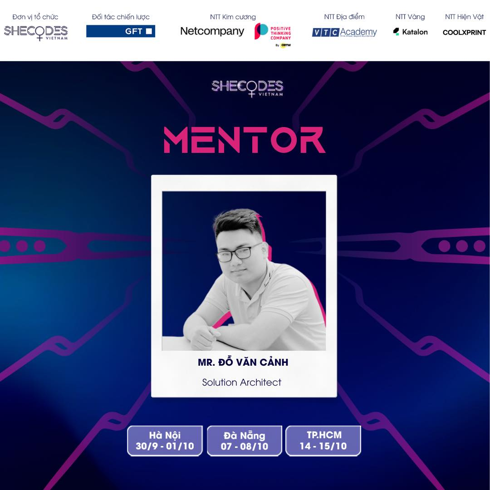

### A self-taught Software Engineer (Android, iOS, Flutter, NestJs, ...) with 5+ years of experience (since 2019 Summer)🤟

## A developer (Android, iOS,NodeJS,ReactJS)

  

## Mentor Hackathon Since

 
  

### Contact me

### Skills

### Hello visitors

   <code>Visitor count</code>
     
   
  
    
   
  

  
  ### Resume and blog
  
  - [2 chương trình Livestream “Hát đối trên sông biên giới” và “Chạy giao lưu hữu nghị quốc tế lần thứ nhất năm 2023 Móng Cái (Việt Nam)- Đông Hưng (Trung Quốc) thu hút hàng trăm ngàn lượt khán giả](https://mongcai.gov.vn/vi-vn/tin/2-chuong-tri%CC%80nh-livestream-ha%CC%81t-do%CC%81i-tren-song-bien-gio%CC%81i%E2%80%9D-va%CC%80-chay-giao-luu-huu-nghi-quoc-te-lan-thu-nhat-nam-2023-mong-cai-viet-nam-dong-hung-trung-quoc-thu-hu%CC%81t-ha%CC%80ng-tram-nga%CC%80n-luo%CC%A3t-kha%CC%81n-gia%CC%89--p24021-c58053-n140911)
   - [GDG tổ chức Hackathon tìm kiếm giải pháp công nghệ lĩnh vực Fintech và Blockchain](https://thesaigontimes.vn/gdg-to-chuc-hackathon-tim-kiem-giai-phap-cong-nghe-linh-vuc-fintech-va-blockchain/?fbclid=IwZXh0bgNhZW0CMTAAAR1a1CGszPCsyA9cNkFxGGqGACSEgFRj6yyR2cYay6kBuJEBlgo6lTfNhNs_aem_Pojk8Y4TxC5gCZ_ANpdIxA)
  - [GDG DevFest MienTrung 2021](https://gdg.community.dev/events/details/google-gdg-mientrung-presents-gdg-devfest-mientrung-2021/)
  - [My Team FPT Hackathon 2021 Winner](https://dantri.com.vn/giao-duc-huong-nghiep/sv-fpt-edu-ung-dung-ai-chan-doan-benh-ngoai-da-20210421064759194.htm?fbclid=IwAR0DZag_64f1zua6OQoUGfDvc0VfX75OeB9Rq8CFdzp9atvd94vdcDW-H0k).
- [Camera AI Hanet ](https://camera14.vn/blogs/news/ra-mat-hanet-ai-camera?fbclid=IwAR0NRslDaZhz-3RwcdahLZ8ycyEIZyD8YaSuQmIrKx7rVGdX0NEovVjWCp4).
- [FPT Hackathon 2019 ](https://fpt.edu.vn/tin-tuc/29901/nhung-doi-thi-dau-tien-cua-cuoc-thi-nghin-do-iot-showcase-contest?fbclid=IwAR1-3quHCNu1oAYNHrKUHRVYppfrMD7kifUFtseei9uQrokO-LZlSaOkLi4).

**Github profile summary** <a href="hhttps://profile-summary-for-github.com/user/canhtommy99dev">https://profile-summary-for-github.com/user/canhtommy99dev</a>

